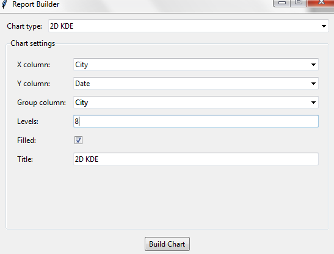

# MiniCharts

MiniCharts is a small desktop application for quickly turning CSV data into
clean, attractive charts. It is intended as a lightweight micro-project for
data exploration: import a file, select and prepare its columns, preview the
result, and create a chart without writing code.

The application is built with Tkinter, pandas, Matplotlib, and Seaborn. It
supports scatter plots, histograms, bar charts, box plots, violin plots, KDE
plots, heatmaps, 2D histograms, and 2D KDE plots.

## Running the application

On Ubuntu, first install Tkinter and the Pillow extension for Tkinter:

```bash
sudo apt update
sudo apt install python3-tk python3-pil.imagetk
```

Then install the Python dependencies and start the application:

```powershell
python -m pip install -r requirements.txt
python app.py
```

## Importing a CSV file


1. Click **Browse** and select a CSV file.
2. Choose the file encoding, column separator, and decimal separator.
3. Click **Read structure** if the first row contains column names, or
   **Generate column names** if it does not.
4. Select the columns to import. You can rename columns and choose their data
   types before importing.
5. Check the preview and click **Import Data**.

## Building a chart

1. Select a chart type in the Report Builder window.
2. Choose the columns and other settings required for the chart.
3. Enter a title if necessary.
4. Click **Build Chart** to display the result.
