# MiniCharts

MiniCharts is a small desktop application for quickly turning CSV data into
clean, attractive charts. It is intended as a lightweight micro-project for
data exploration: import a file, select and prepare its columns, preview the
result, and create a chart without writing code.

The application is built with Tkinter, pandas, Matplotlib, and Seaborn. It
supports scatter plots, histograms, bar charts, box plots, violin plots, KDE
plots, heatmaps, 2D histograms, and 2D KDE plots.

## Running the application

On Ubuntu, first install Tkinter and the Pillow extension for Tkinter:

```bash
sudo apt update
sudo apt install python3-tk python3-pil.imagetk
```

Then install the Python dependencies and start the application:

```powershell
python -m pip install -r requirements.txt
python app.py
```

## Importing a CSV file
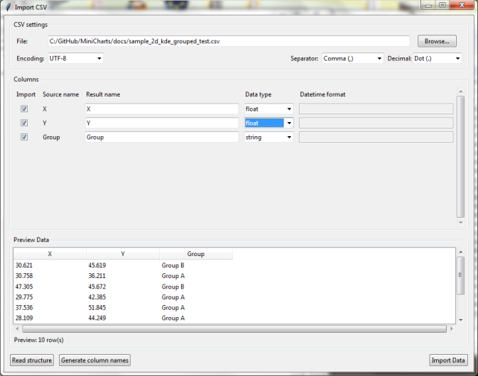

1. Click **Browse** and select a CSV file.
2. Choose the file encoding, column separator, and decimal separator.
3. Click **Read structure** if the first row contains column names, or
   **Generate column names** if it does not.
4. Select the columns to import. You can rename columns and choose their data
   types before importing.
5. Check the preview and click **Import Data**.

## Building a chart
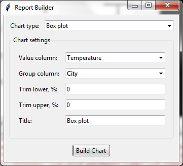
1. Select a chart type in the Report Builder window.
2. Choose the columns and other settings required for the chart.
3. Enter a title if necessary.
4. Click **Build Chart** to display the result.

## Samples

### 2D Histogram

A 2D histogram shows the density of observations across two numeric dimensions. It is especially useful when a scatter plot contains too many overlapping points.

| UI                                           | Chart                                  |
| -------------------------------------------- | -------------------------------------- |
| 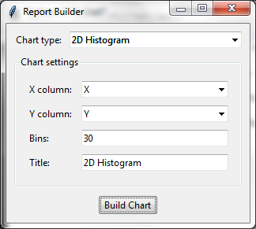 | 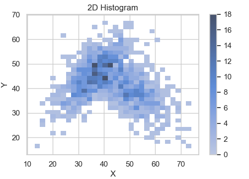 |

### 2D KDE

A 2D KDE plot shows a smoothed estimate of point density using contour lines. Grouping makes it easy to compare the shape and overlap of several two-dimensional distributions.

| UI                               | Chart                      |
| -------------------------------- | -------------------------- |
| 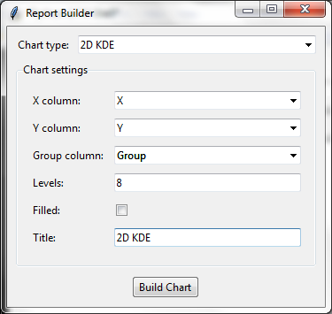 | 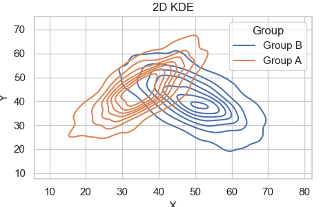 |

### Bar Chart

A bar chart compares aggregated values across categories. It can also split each category into groups for side-by-side comparison.

| UI                               | Chart                      |
| -------------------------------- | -------------------------- |
| 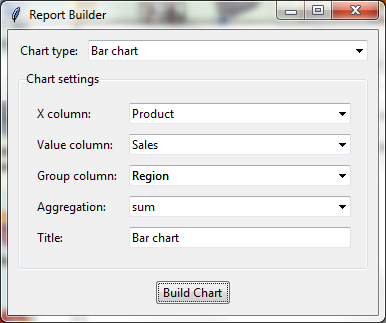 | 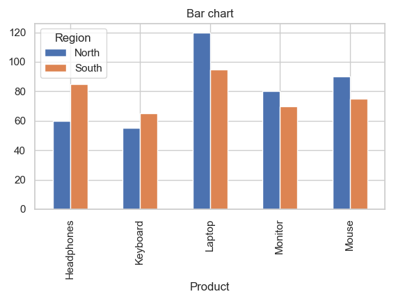 |

### Box Plot

A box plot summarizes a distribution using its median, quartiles, spread, and outliers. It is convenient for quickly comparing distributions between groups.

| UI                              | Chart                     |
| ------------------------------- | ------------------------- |
|  | 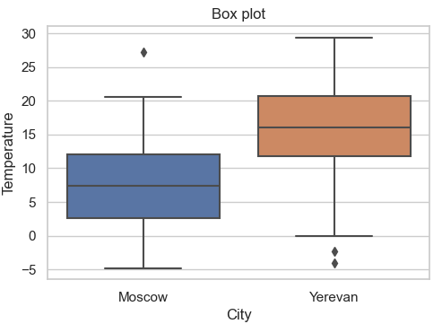 |

### Heatmap

A heatmap represents aggregated values in a two-dimensional matrix using color intensity. It is useful for visualizing patterns across two categorical dimensions, such as product by month.

| UI                                 | Chart                        |
| ---------------------------------- | ---------------------------- |
| 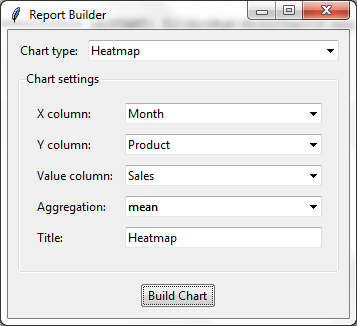 | 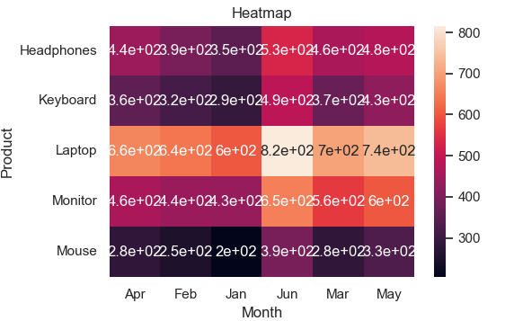 |

### Histogram

A histogram shows the distribution of a numeric variable by dividing its range into bins. Multiple groups can be displayed either as overlapping or side-by-side distributions.

| UI                                     | Chart                            |
| -------------------------------------- | -------------------------------- |
| 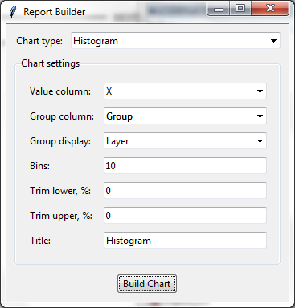 | 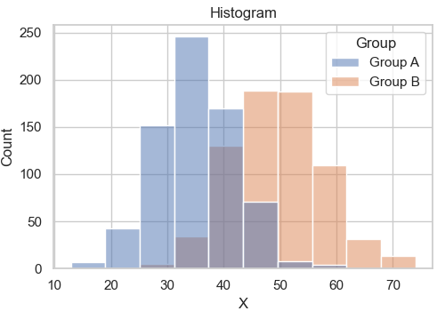 |

### KDE Plot

A KDE plot shows a smooth estimate of a numeric distribution. It is particularly useful for comparing the shapes of several distributions without depending on histogram bin boundaries.

| UI                              | Chart                     |
| ------------------------------- | ------------------------- |
| 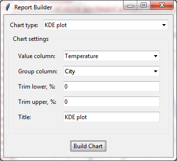 | 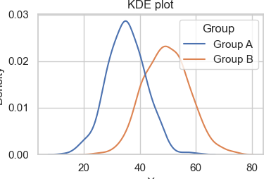 |

### Scatter Plot

A scatter plot shows the relationship between two numeric variables, with each row represented as a point. Optional grouping helps reveal differences between categories.

| UI                                     | Chart                            |
| -------------------------------------- | -------------------------------- |
| 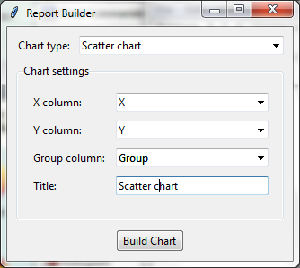 | 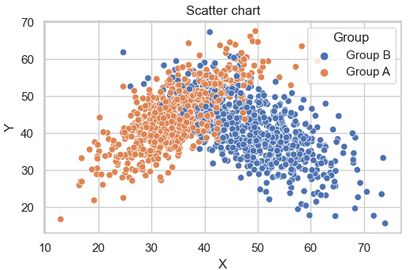 |

### Violin Plot

A violin plot combines a distribution-density view with summary statistics. It makes differences in distribution shape between groups easy to see.

| UI                                    | Chart                           |
| ------------------------------------- | ------------------------------- |
| 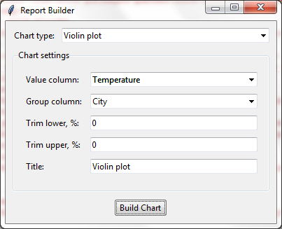 | 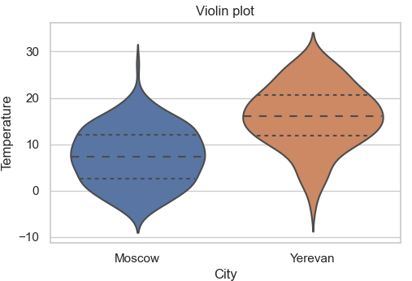 |


